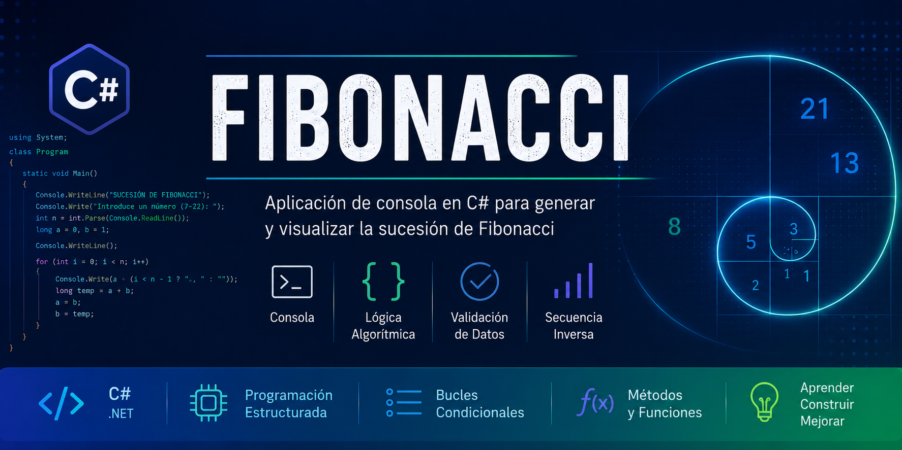

<p align="center">
  
</p>

# 🔢 Fibonacci

> Aplicación de consola desarrollada en **C#** para generar y visualizar la sucesión de Fibonacci como práctica de programación estructurada y lógica algorítmica.

---

# 📋 Descripción

Este proyecto fue desarrollado durante el **Ciclo Formativo de Grado Superior en Desarrollo de Aplicaciones Web (DAW)** como ejercicio de aprendizaje para reforzar conceptos fundamentales de programación en **C#**.

La aplicación solicita al usuario un número dentro de un rango determinado, genera la sucesión de Fibonacci correspondiente y muestra tanto la secuencia generada como su recorrido inverso.

Aunque se trata de una aplicación sencilla, permite practicar estructuras de control, manejo de variables, interacción con el usuario y diseño de algoritmos.

---

# 🎯 Objetivos

- Comprender el funcionamiento de la sucesión de Fibonacci.
- Practicar la programación estructurada en C#.
- Implementar algoritmos iterativos.
- Validar la entrada de datos del usuario.
- Consolidar el uso de bucles y variables.

---

# 🛠 Tecnologías utilizadas

- C#
- .NET
- Visual Studio

---

# ✨ Funcionalidades

- Solicita al usuario un número entero comprendido entre **7 y 22**.
- Valida que el valor introducido se encuentre dentro del rango permitido.
- Genera la sucesión de Fibonacci mediante un algoritmo iterativo.
- Muestra la secuencia generada por consola.
- Presenta la sucesión en orden inverso.

---

# 📷 Capturas

*(Pendiente de añadir capturas de la ejecución de la aplicación.)*

---

# 📂 Estructura del proyecto

```text
Fibonacci/
├── assets/
│   ├── banner.png
│   └── (capturas)
├── Program.cs
└── README.md
```

---

# 🚀 Cómo ejecutar el proyecto

1. Clonar el repositorio.
2. Abrir el proyecto con **Visual Studio**.
3. Compilar la solución.
4. Ejecutar la aplicación desde la consola.

---

# 💡 Conceptos trabajados

Durante el desarrollo de este proyecto se practicaron conceptos como:

- Variables y tipos de datos.
- Bucles (`while`).
- Condicionales (`if`).
- Validación de entradas.
- Algoritmos iterativos.
- Programación de aplicaciones de consola.
- Manipulación de secuencias numéricas.

---

# 📚 Aprendizajes

Este proyecto permitió consolidar conocimientos básicos de programación en C#, especialmente relacionados con el diseño de algoritmos y el control del flujo de ejecución.

También sirvió como introducción al desarrollo de aplicaciones de consola y a la resolución de problemas mediante programación estructurada.

---

# 🔮 Posibles mejoras

- Permitir cualquier valor positivo utilizando `BigInteger`.
- Implementar una versión recursiva del algoritmo para comparar ambas soluciones.
- Añadir una interfaz gráfica (Windows Forms o WPF).
- Exportar la secuencia generada a un archivo de texto.
- Comparar tiempos de ejecución entre distintas implementaciones.

---

# 👨‍💻 Autor

**Jesús Díaz**

Técnico Superior en Desarrollo de Aplicaciones Web  
Junior Cybersecurity Analyst

- 💼 LinkedIn: https://www.linkedin.com/in/jesus-diaz-exposito
- 🌐 Portfolio: https://jediex69.github.io
- 🐙 GitHub: https://github.com/Jediex69

---

> *"Cada proyecto representa un paso más en mi evolución como desarrollador y profesional del sector IT."*
