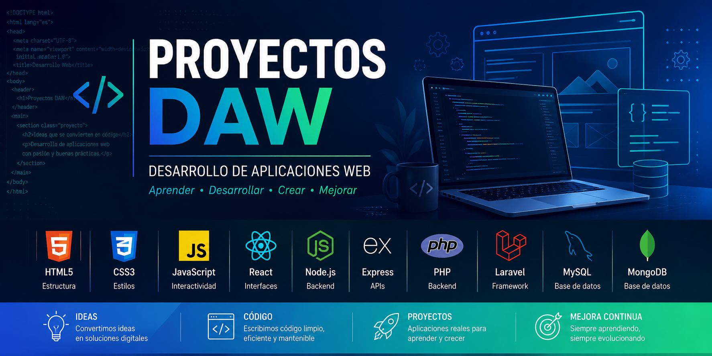

<p align="center">
  
</p>

# 💻 Proyectos DAW

> Colección de proyectos desarrollados durante el **Ciclo Formativo de Grado Superior en Desarrollo de Aplicaciones Web (DAW)**.

En este repositorio recopilo algunos de los proyectos realizados durante mi formación como **Técnico Superior en Desarrollo de Aplicaciones Web**, aplicando tecnologías frontend, backend, bases de datos y desarrollo Full Stack.

Cada proyecto representa una etapa de aprendizaje y refleja la evolución de mis conocimientos en programación, arquitectura de aplicaciones y desarrollo web.

---

# 🎯 Objetivos

Este repositorio tiene como finalidad:

- Consolidar los conocimientos adquiridos durante el CFGS DAW.
- Documentar proyectos desarrollados durante la formación.
- Mostrar la evolución técnica a lo largo del ciclo.
- Servir como portfolio de desarrollo web.

---

# 📚 Proyectos disponibles

| Proyecto | Tecnologías | Estado |
|----------|-------------|--------|
| 🎟 Compra de Entradas | HTML · CSS · JavaScript | ✅ |
| 🔢 Fibonacci | C# | ✅ |
| 📚 API Biblioteca | Node.js · Express | ✅ |
| 🌐 MERN Stack | MongoDB · Express · React · Node.js | 🚧 |

---

# 🛠 Tecnologías

### Frontend

- HTML5
- CSS3
- JavaScript
- React
- Bootstrap

### Backend

- Node.js
- Express
- PHP
- Laravel

### Bases de datos

- MySQL
- MongoDB

### Otros

- Git
- GitHub
- Visual Studio
- Visual Studio Code

---

# 📂 Estructura del repositorio

```text
Proyectos_DAW
│
├── Compra de entradas/
├── Fibonacci/
├── api-biblioteca/
├── mern-stack/
│
└── assets/
```

---

# 🚧 Próximas mejoras

- Añadir nuevos proyectos desarrollados tras finalizar el CFGS.
- Unificar la documentación de todos los proyectos.
- Incorporar capturas de pantalla.
- Mejorar la estructura de los README individuales.

---

# 👨‍💻 Autor

**Jesús Díaz**

Técnico Superior en Desarrollo de Aplicaciones Web  
Junior Cybersecurity Analyst

- 💼 LinkedIn: https://www.linkedin.com/in/jesus-diaz-exposito
- 🌐 Portfolio: https://jediex69.github.io
- 🐙 GitHub: https://github.com/Jediex69

---

> *"Cada proyecto representa un paso más en mi evolución como desarrollador y profesional del sector IT."*
